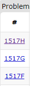

# Codeforces Practice

I Plan to Solve 5 Practice Questions on [Codeforces](https://codeforces.com/) Daily. This Repository Includes C++ Solutions of All the Questions That I will Solve.

---

## What is Here for You ?

1. Use GitHub Search Bar & Search a Question with Question ID and Checkout Its Solution. <br/>
    <br/>
   

2. Every Solution is Categorised by Level (A, B, ...) and Also Have a Question Link. You Can Simply Go To the Question and Practice With Me.

---

### Project Structure :

```
    .
    ├── A
    │   ├── [QuestionID].cpp
    │   └── ...
    ├── B
    │   └── ...
    ├── C
    │   └── ...
    ├── ...
    │
    └── README.md
```
